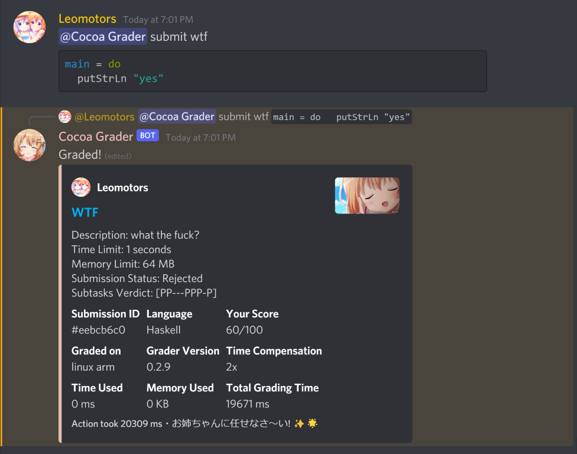
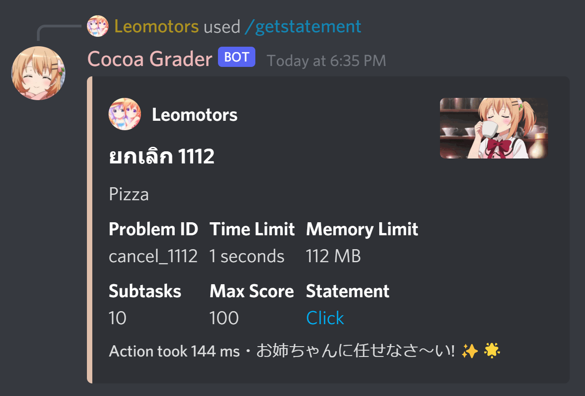
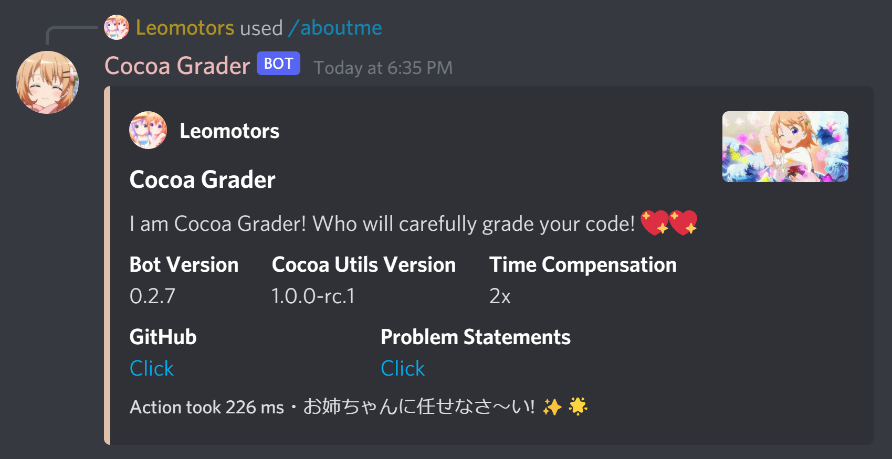
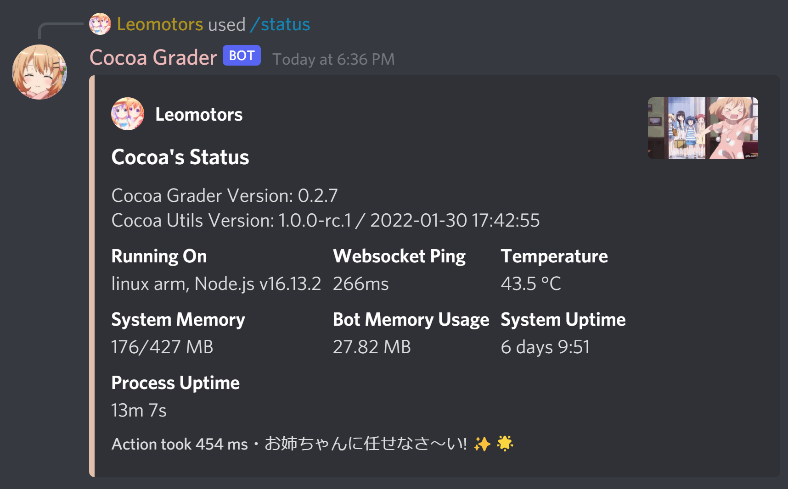

# Cocoa Grader

A Discord Bot Grader, more specifically, '*Waifu*'

~~Created to compete with [Cafe Grader](https://github.com/cafe-grader-team/cafe-grader-web)~~

## 🌲 Dependencies

### To Start the Bot

- nodejs (16.9+) with npm, yarn

### To make sure no error occurred

- gcc

- pshved/timeout installed to bin, [see here](https://unix.stackexchange.com/a/44988)

- Use some powerful devices (I use Raspberry Pi 😖)

## 🖼️ Gallery of Cocoa Grader

*All pictures are at Version 0.2.7 except for submit is at 0.2.9*









## How to add problem

The problems folder is at `./problems`

It requires a `manifest.json` file, which is a json file with the following format:

```json
{
    "problemLists": [problemId: string]
}
```

For each problem it need a folder with the same name as the problemId. In that folder requires a `manifest.json` file, which is a json file with the following format:

```json
{
    "title": string,
    "description": string,
    "timelimit": number,
    "memorylimit": number,
    "subtasks": { [name: string]: number },
    "maxScore": number, // optional
    "statement": string, // optional,
    "compare": CompareType // optional,
}
```

For the subtask will store in `testcase` folder with is in the same level with `manifest.json` file. In that folder will contain `<subtask_name>.in` and `<subtask_name>.out` files. 
